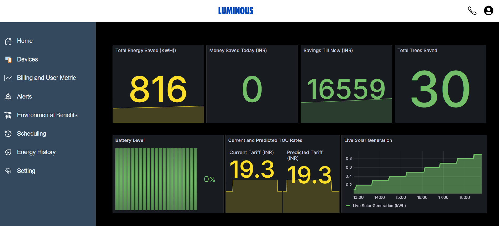
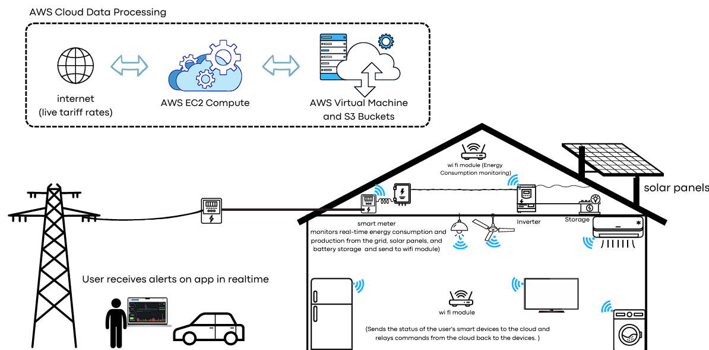
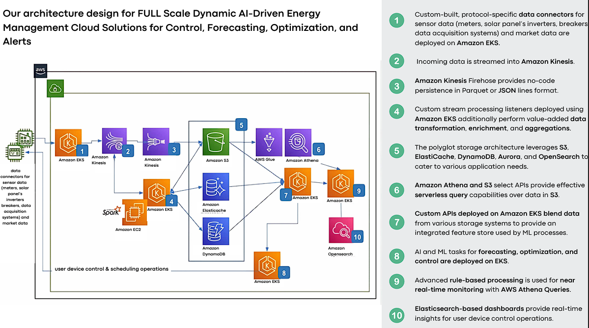
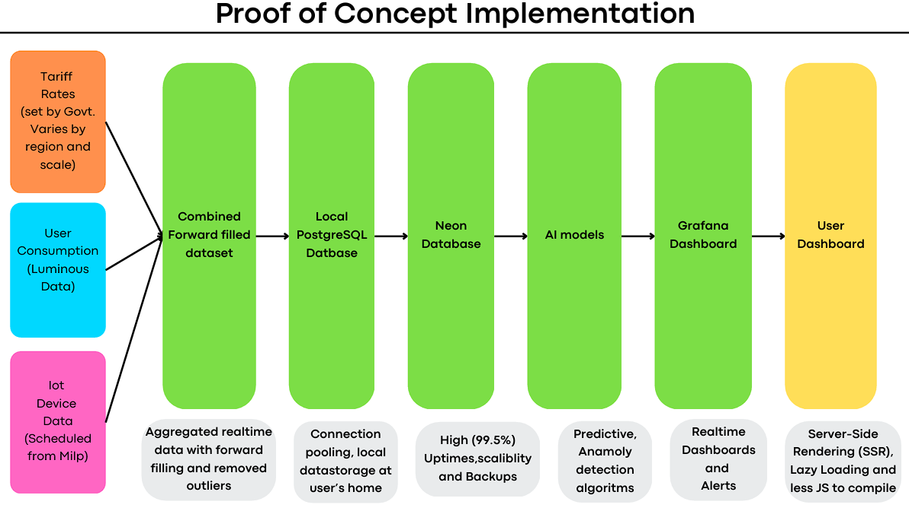
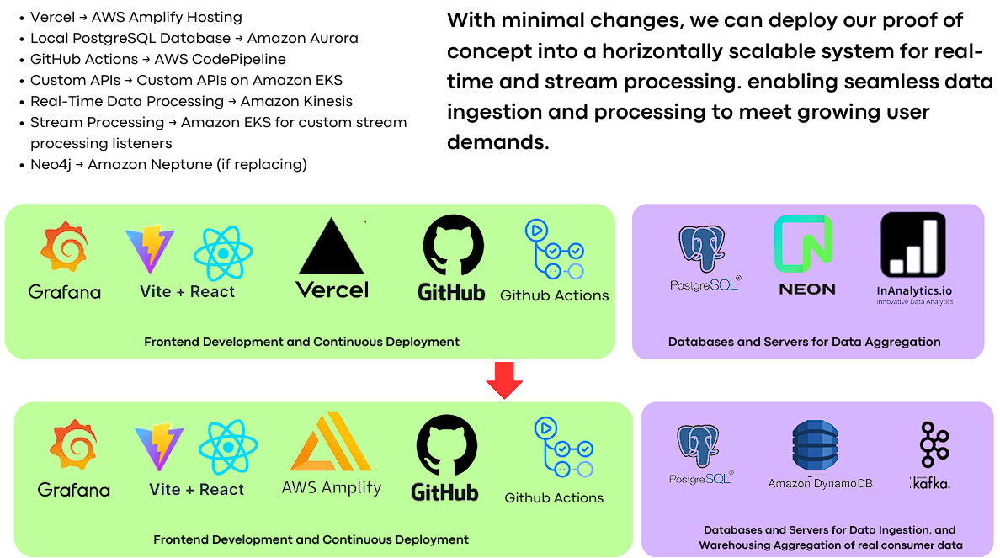

# SolarWise

# SolarWise: AI-Powered Energy Management Solutions ☀️

  
  
  

---

## Overview  

SolarWise integrates IoT devices, cloud computing, and AI to offer real-time monitoring, predictive analytics, and smart optimization of energy usage. Designed to empower users with better control, reduce costs, and enhance solar energy utilization.  

### THE USERNAME & PASSWORD IS luminous

---

## Dashboard Highlights  
  

- Real-Time Tariff Monitoring  
- Energy Consumption Analytics  
- Smart Scheduling  
- Solar Energy Management  
- Forecasting and Recommendations  
- User Notifications and Alerts  
- Cost-Benefit Analysis  

---

## Features  

### 1. Real-Time Monitoring  
- Live solar power and energy consumption stats.  
- IoT device connectivity and status updates.  
- Time-of-Use (TOU) tariff tracking.  

### 2. Predictive Analytics  
- **Energy Consumption Forecast** (Linear Regression, R² > 90%)  
- **TOU Tariff Rate Prediction** (LSTM, 92% accuracy).  

### 3. Smart Optimization  
- **Anomaly Detection** (Z-Score, 95% precision).  
- **Optimal Device Scheduling** (MILP, 100% efficiency).  

---

## System Architecture  

### IoT Integration Layer  
  

### Data Flow Architecture 
  

**Highlights:**  
1. **Data Ingestion:** AWS Kinesis, EKS.  
2. **Storage:** S3, DynamoDB, ElastiCache, Aurora.  
3. **Analytics & Predictions:** AWS Athena, OpenSearch.  
4. **User Interaction:** Intuitive dashboards, real-time alerts.  

---

## Implementation  

### Proof of Concept  
  

---

## Performance Metrics  

| Model Type         | Accuracy | Use Case                  |  
|--------------------|----------|---------------------------|  
| LSTM               | 92%      | TOU Tariff Predictions    |  
| Linear Regression  | >90%     | User Consumption Forecast |  
| Z-Score            | 95%+     | Anomaly Detection         |  
| MILP               | 100%     | Smart Scheduling          |  

---

## Why SolarWise?  

1. **Modular & Scalable Architecture**
     
   - Handles high-volume energy data efficiently.  
   - Customizable for diverse markets.  

3. **User Flexibility**  
   - Remote monitoring with intuitive UI.  
   - Anywhere, anytime control.  

4. **Energy Optimization**  
   - AI-enhanced cost savings.  
   - Environmentally conscious practices.  

---

### Prerequisites  
- AWS Account and IoT-ready devices.  
- Smart meters and internet connectivity.  

### Key AWS Services  
- EC2, Kinesis, S3, ElastiCache, DynamoDB, Athena, OpenSearch, Glue.  

---

## License  
This project is a proprietary submission for the Luminous TechnoX Hackathon 2024. Reuse or reproduction of this content is prohibited.  

---

**Note:** Developed as part of the Luminous TechnoX Hackathon 2024.
